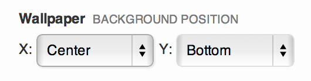
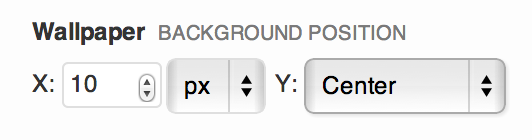
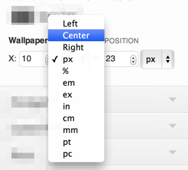

<!-- DO NOT EDIT THIS FILE; it is auto-generated from readme.txt -->
# Styles Control: background-position

Extension for Styles plugin to add a background-position control type

**Contributors:** [x-team](http://profiles.wordpress.org/x-team), [westonruter](http://profiles.wordpress.org/westonruter)  
**Tags:** [styles](http://wordpress.org/plugins/tags/styles), [customizer](http://wordpress.org/plugins/tags/customizer), [background](http://wordpress.org/plugins/tags/background)  
**Requires at least:** 3.6  
**Tested up to:** 3.6  
**Stable tag:** trunk (master)  
**License:** [GPLv2 or later](http://www.gnu.org/licenses/gpl-2.0.html)  

## Description ##

This is a plugin/extension for the [Styles plugin](http://stylesplugin.com/). It adds a new `background-position` control type
which can be referenced by that ID in the `type` field of the control defined in your customize.json. It allows you to specify
the X and Y coordinates separately, allowing lengths of any unit, as well as keywords.

## Screenshots ##

### Set pixel X and Y coordinates

### Use keyword positions for X and Y coordinates

### Use a pixel value and a keyword value for either dimension

### Change unit from pixel to percentage and other CSS units

## Changelog ##

### 0.1.0 ###
First Release

